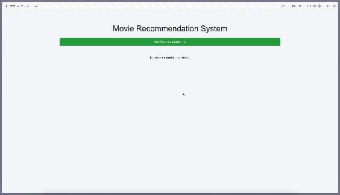

# Movie Recommendation System with Flask and GloVe

## Demonstration


## Description
This project is a **Movie Recommendation System** developed using **Flask** and **GloVe** embeddings, employing **Content-Based Filtering** techniques. The application recommends movies based on the content of the movies, such as their titles and overviews.

## Features
- Utilizes **GloVe** for embedding movie descriptions.
- Implements a **Content-Based Filtering** algorithm to generate recommendations.
- User-friendly interface built with **Bootstrap** for responsiveness and elegance.

## Technologies Used
- **Flask**: A lightweight WSGI web application framework.
- **GloVe**: Global Vectors for Word Representation.
- **Pandas**: For data manipulation and analysis.
- **NumPy**: For numerical operations.
- **scikit-learn**: For computing cosine similarity.
- **NLTK**: For natural language processing tasks.

## Installation

1. Clone the repository:
   ```bash
   git clone <repository-url>
   cd <repository-name>
   ```

2. Create a virtual environment (if you haven't already):
   ```bash
   python -m venv .venv
   ```

3. Activate the virtual environment:
   - On Windows:
     ```bash
     .venv\Scripts\activate
     ```
   - On macOS/Linux:
     ```bash
     source .venv/bin/activate
     ```

4. Install the required packages:
   ```bash
   pip install flask gensim nltk pandas numpy scikit-learn
   ```

5. Download the necessary NLTK resources:
   ```python
   import nltk
   nltk.download('punkt')
   nltk.download('stopwords')
   ```

6. Place your `metadata.csv` file in the `data` directory. Ensure it contains the necessary columns: `original_title` and `overview`.

## Usage
Run the application:
```bash
flask run
```
Visit `http://127.0.0.1:5000` in your web browser to access the movie recommendation system.

## License
This project is licensed under the MIT License - see the [LICENSE](LICENSE) file for details.
